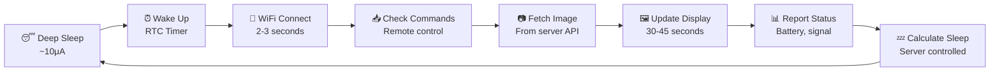

# 🖼️ Glance - ESP32 E-Ink Display System

> A battery-powered ESP32 e-ink display that fetches images from a local Raspberry Pi server with intelligent power management and remote control.

## ✨ Features

🔋 **Ultra-Low Power** - Months of battery life with deep sleep cycles
🌐 **Local Server** - Runs on your Raspberry Pi, no cloud dependencies
🎨 **6-Color Display** - Beautiful Spectra 6 e-paper technology
🤖 **AI Art Generation** - GPT-4o powered artwork optimized for e-ink displays
🎲 **Feeling Lucky** - Expand simple prompts into detailed AI art ideas (or get surprised)
📱 **Web Dashboard** - Upload images, generate art, and monitor devices remotely
⚡ **Smart Scheduling** - Server controls update frequency dynamically
🎛️ **Remote Control** - Stay awake and force update commands
🐳 **Docker Ready** - Easy server deployment with published Docker images

## 🏗️ Architecture

```
┌─────────────────┐    WiFi     ┌─────────────────┐
│                 │◄───────────►│                 │
│     ESP32       │             │  Raspberry Pi   │
│   (Display)     │    HTTP     │    (Server)     │
│                 │             │                 │
└─────────┬───────┘             └─────────────────┘
          │ SPI                          │
          ▼                              │ Port 3000
┌─────────────────┐                      ▼
│  Waveshare      │               ┌─────────────────┐
│  13.3" E-Ink    │               │  Web Dashboard  │
│  Spectra 6      │               │                 │
└─────────────────┘               └─────────────────┘
```

**How it works:**
1. ESP32 wakes from deep sleep every 1-6 hours
2. Connects to WiFi and fetches current image from Raspberry Pi server
3. Updates the e-ink display with new content
4. Reports battery status and device health
5. Enters deep sleep until next scheduled wake-up

## 🛠️ Hardware Requirements

| Component | Model | Purpose |
|-----------|-------|---------|
| **Microcontroller** | ESP32 (HUZZAH32 recommended) | WiFi + Processing |
| **Display** | Waveshare 13.3" Spectra 6 | 1200×1600 6-color e-paper |
| **Server** | Raspberry Pi 3/4/Zero 2W | Local server hosting |
| **Power** | LiPo Battery (3.7V) | Portable operation |
| **Interface** | SPI + GPIO | Display communication |

### 🔌 ESP32 to Display Connections

| ESP32 Pin | HAT+ Pin | Function |
|-----------|----------|----------|
| 21        | PWR      | Power Control |
| 15        | BUSY     | Busy Signal |
| 4         | RST      | Reset |
| 17        | DC       | Data/Command |
| 16        | CS_S     | Chip Select Slave |
| 5         | CS_M     | Chip Select Master |
| 18        | CLK      | SPI Clock |
| 23        | DIN      | SPI Data |
| GND       | GND      | Ground |
| 3V        | VCC      | Power Supply |

## 🚀 Quick Start

### 1. 🥧 Deploy Server (Raspberry Pi)

**Option A: One-command deploy**
```bash
./deploy-to-pi.sh serverpi.local your-dockerhub-username
```

**Option B: Manual Docker deploy**
```bash
# On your Raspberry Pi
docker run -d \
  --name glance-server \
  -p 3000:3000 \
  -v $(pwd)/data:/app/data \
  --restart unless-stopped \
  your-username/glance-server:latest
```

### 2. 🌐 Configure via Web Dashboard

Access the dashboard at: `http://your-pi-ip:3000`

- 🖼️ Upload and optimize images for e-paper display
- 🤖 Generate AI artwork with GPT-4o (requires `OPENAI_API_KEY`)
- 🎲 Use "Feeling Lucky" to expand simple prompts into art
- ⏰ Set sleep schedules (5 minutes to 12 hours)
- 📊 Monitor ESP32 battery levels and status
- 📋 View real-time device logs
- 🎛️ Send remote commands (stay awake, force update)

### 3. 🔧 Setup ESP32 Client

```bash
# Clone repository
git clone https://github.com/your-username/Glance.git
cd Glance/esp32-client/

# Set WiFi credentials
export WIFI_SSID="YourWiFiNetwork"
export WIFI_PASSWORD="YourWiFiPassword"
export DEVICE_ID="esp32-001"  # Optional: unique device ID

# Build and upload firmware
./build.sh
```

### 4. 🔋 Deploy Device

1. Connect LiPo battery to ESP32 BAT pin
2. Verify display shows test pattern or fetched image
3. Check web dashboard shows device as "online"
4. System now runs autonomously!

## 🔄 Operation Cycle



## 📡 API Endpoints

The ESP32 communicates with these server endpoints:

- **`GET /api/current.json`** - Fetch current image and sleep duration
- **`POST /api/device-status`** - Report device health (battery, WiFi signal)
- **`POST /api/logs`** - Send device logs to server
- **`GET /api/commands/:deviceId`** - Check for pending remote commands

## 🎛️ Remote Control Features

Send commands to sleeping devices via web dashboard:

- **📱 Stay Awake** - Keep device active for 5 minutes for debugging
- **🔄 Force Update** - Trigger immediate display refresh
- **📊 View Logs** - Real-time ESP32 serial output
- **🔋 Battery Monitor** - Track voltage and charging status

## 📁 Project Structure

```
Glance/
├── esp32-client/           # ESP32 firmware
│   ├── src/main.cpp       # Main ESP32 application
│   ├── lib/epd/           # Waveshare display drivers
│   ├── config.h           # Hardware configuration
│   ├── build.sh           # Build and upload script
│   └── platformio.ini     # PlatformIO configuration
├── server/                 # Node.js server
│   ├── server.js          # Express.js API server
│   ├── __tests__/         # Test suite
│   ├── package.json       # Dependencies
│   └── Dockerfile         # Container build
├── scripts/               # Deployment automation
│   ├── deploy-to-pi.sh    # Raspberry Pi deployment
│   └── build-and-push.sh  # Docker Hub publishing
└── docker-compose.yml     # Local development
```

## 🎨 Image Processing & AI Art

### Image Processing
- **🌈 6-Color Optimization** - Automatic conversion to Spectra 6 palette (black, white, yellow, red, blue, green)
- **✨ Floyd-Steinberg Dithering** - Professional quality color mapping for art reproduction
- **📦 Server-Side Processing** - Reduces ESP32 memory usage
- **✂️ Auto-Crop** - Removes whitespace margins from AI-generated images
- **🔆 Contrast Enhancement** - Optimizes images for e-ink characteristics
- **🔄 Rotation Support** - 0°, 90°, 180°, or 270° rotation
- **📺 Full Resolution** - 1150×1550 pixels (93% screen coverage)

### AI Art Generation
- **🤖 GPT-4o Integration** - Generate custom artwork via OpenAI image models
- **🎲 Feeling Lucky** - GPT-4o-mini expands simple prompts into detailed art descriptions
- **📜 Prompt History** - View the original prompt used to generate any artwork
- **🎨 E-Ink Optimized** - AI prompts emphasize full-bleed, high-contrast compositions
- **💾 Image Archive** - Automatically stores last 50 generated images with metadata

## 📊 Performance & Power

| Metric | Value | Notes |
|--------|-------|-------|
| **Display Resolution** | 1150×1550px | 93% screen area |
| **Refresh Time** | 30-45 seconds | Full 6-color update |
| **Deep Sleep Current** | ~10μA | Months of battery life |
| **Active Current** | ~100mA | WiFi + display update |
| **Wake-up Time** | 2-3 seconds | WiFi connection ready |
| **Battery Life** | 3-6 months | 3000mAh LiPo, 6-hour cycle |

## 🔧 Development

### Server Development
```bash
cd server/
npm install
npm run dev      # Auto-reload development
npm test         # Run test suite
npm run coverage # Test coverage report
```

### ESP32 Development
```bash
cd esp32-client/
./build.sh compile  # Build only
./build.sh upload   # Build + upload + monitor
./build.sh monitor  # Serial monitor only
./build.sh clean    # Clean build files
```

## 🚢 Deployment & Updates

### Automated Deployment
Pushing to `main` branch automatically:
1. Runs full test suite
2. Builds multi-architecture Docker image
3. Deploys to Raspberry Pi via Tailscale SSH
4. Updates running container with zero downtime

### Manual Deployment
```bash
# Deploy specific version
IMAGE_VERSION=abc1234 ./deploy-to-pi.sh serverpi.local your-username

# Check running version
docker exec glance-server env | grep IMAGE_VERSION
```

## 🐛 Troubleshooting

### ESP32 Issues
- **WiFi fails**: Check SSID/password, ensure 2.4GHz network
- **Display blank**: Verify SPI connections, check power supply
- **Won't sleep**: Check for active serial monitor connection
- **Battery drain**: Verify deep sleep current with multimeter

### Server Issues
- **Can't access dashboard**: Check port 3000, firewall settings
- **Images not processing**: Verify Sharp dependencies installed
- **Container won't start**: Check disk space, Docker daemon

### Network Issues
- **ESP32 can't reach server**: Check `serverpi.local` resolution
- **Slow image downloads**: Verify network bandwidth, WiFi signal
- **Commands not working**: Ensure device recently active (within 5 min)

## 🗺️ Roadmap

### ✅ Completed
- [x] ESP32 firmware with power management
- [x] Node.js server with web dashboard
- [x] Remote device control and monitoring
- [x] Multi-device support
- [x] Automated deployment pipeline
- [x] Comprehensive test coverage

### 🚧 In Progress
- [ ] User authentication and device pairing
- [ ] Solar charging integration
- [ ] Weather and calendar widgets

### 🔮 Future
- [ ] Mobile app for device management
- [ ] Multi-zone content layouts
- [ ] Voice control integration
- [ ] Mesh networking for multiple displays

---

**Ready to build your own smart e-ink display?** 🚀

Start with the [Quick Start](#-quick-start) guide above!
