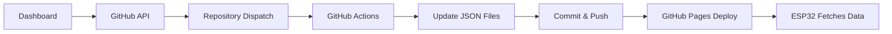

# GitHub API + Actions Setup Guide

This guide will help you set up the GitHub API + Actions approach for persistent data storage with your Glance e-ink display system.

## 🔧 Setup Overview

1. **GitHub Actions** - Automatically update API files when triggered
2. **Repository Dispatch** - Dashboard triggers Actions via GitHub API
3. **Personal Access Token** - Secure authentication for API calls
4. **Real-time Sync** - Polling for automatic updates

## 📋 Step-by-Step Setup

### Step 1: Create a Personal Access Token

1. **Go to GitHub Settings**
   - Navigate to: https://github.com/settings/tokens/new
   - Or: GitHub → Settings → Developer settings → Personal access tokens → Tokens (classic)

2. **Configure the Token**
   - **Note**: `Glance Display Manager`
   - **Expiration**: `90 days` (or longer)
   - **Scopes**: Check `repo` (Full control of private repositories)

3. **Generate and Copy Token**
   - Click "Generate token"
   - **IMPORTANT**: Copy the token immediately (starts with `ghp_`)
   - Store it securely - you won't see it again!

### Step 2: Configure Your Dashboard

1. **Open your Glance dashboard**
   - Go to: https://chaerem.github.io/Glance/

2. **Navigate to Devices Tab**
   - Click on the "Devices" tab
   - Find the "GitHub Integration" section

3. **Connect to GitHub**
   - Paste your Personal Access Token
   - Click "Connect"
   - You should see a green "Connected" status

### Step 3: Enable GitHub Actions

GitHub Actions should already be enabled for your repository, but verify:

1. **Check Actions Tab**
   - Go to your repository: https://github.com/CHaerem/Glance
   - Click the "Actions" tab
   - You should see the workflow: "Update Display Data"

2. **Verify Permissions**
   - Settings → Actions → General
   - Ensure "Allow all actions and reusable workflows" is selected
   - Under "Workflow permissions", select "Read and write permissions"

### Step 4: Test the Integration

1. **Upload an Image**
   - In your dashboard, go to "Upload Image" tab
   - Upload any image file
   - Set it as the current display image

2. **Check GitHub**
   - Go to your repository's Actions tab
   - You should see a new workflow run: "🖼️ Update current image"
   - The run should complete successfully (green checkmark)

3. **Verify API Update**
   - Check: https://chaerem.github.io/Glance/api/current.json
   - It should contain your new image data

## 🔄 How It Works

### Dashboard → GitHub Actions Flow



### Triggered Actions

The system uses three main action types:

1. **`update-current-image`** - When you set a new display image
2. **`update-device-status`** - When ESP32 reports status
3. **`update-schedule`** - When you change update intervals

### File Structure

Actions update these files:
```
docs/api/
├── current.json        # Current image for ESP32
├── devices.json        # Device registry
├── images.json         # Image library
├── schedule.json       # Update schedule
└── timestamp.json      # Last update time
```

## 🚀 ESP32 Configuration

Your ESP32 firmware is already configured to use the GitHub API endpoints:

```cpp
const char* API_BASE_URL = "https://chaerem.github.io/Glance/api/";
```

The ESP32 will:
1. **Fetch** from `current.json` for image data
2. **Post** to the GitHub API for status updates (via Actions)

## 🔒 Security Notes

- **Token Storage**: Tokens are stored locally in your browser only
- **Repository Access**: Token only has access to your Glance repository
- **Rate Limits**: GitHub API allows 5,000 requests/hour with token
- **Actions Minutes**: 2,000 minutes/month free on GitHub

## 🐛 Troubleshooting

### "Failed to connect to GitHub"
- Check your token has `repo` scope
- Verify token hasn't expired
- Ensure repository name is correct

### Actions not triggering
- Check repository has Actions enabled
- Verify workflow file exists: `.github/workflows/update-display-data.yml`
- Check token has write permissions

### API files not updating
- Look at Actions tab for error messages
- Check if GitHub Pages is properly configured
- Verify JSON validation in workflow logs

### Rate limiting
- Dashboard shows remaining API calls
- Wait for rate limit reset (shown in dashboard)
- Consider reducing polling frequency

## 📊 Monitoring

The dashboard provides real-time monitoring:

- **Connection Status**: GitHub API connectivity
- **Rate Limits**: Remaining API calls
- **Repository Stats**: Commits, size, last update
- **Recent Changes**: Commit history for API updates

## 🔄 Real-time Updates

The system polls for changes every 30 seconds:

1. **Dashboard checks** `timestamp.json` for updates
2. **If changed**, fetches latest data from GitHub
3. **Updates interface** with new information
4. **ESP32 fetches** data on its own schedule

## 🎯 Next Steps

1. **Test image uploads** and verify they appear in your repository
2. **Configure update schedules** for your ESP32
3. **Flash ESP32 firmware** with your WiFi credentials
4. **Monitor device status** in the dashboard

Your GitHub-powered, battery-efficient e-ink display system is now ready! 🖼️⚡